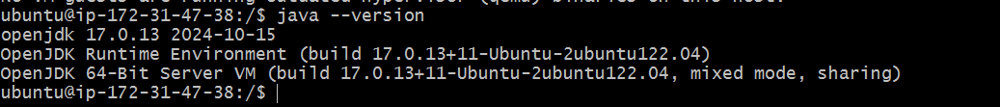
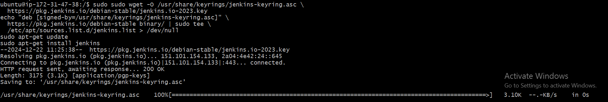
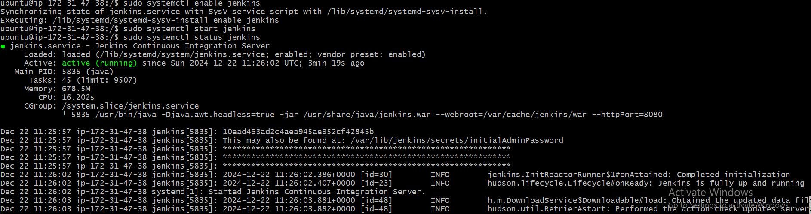
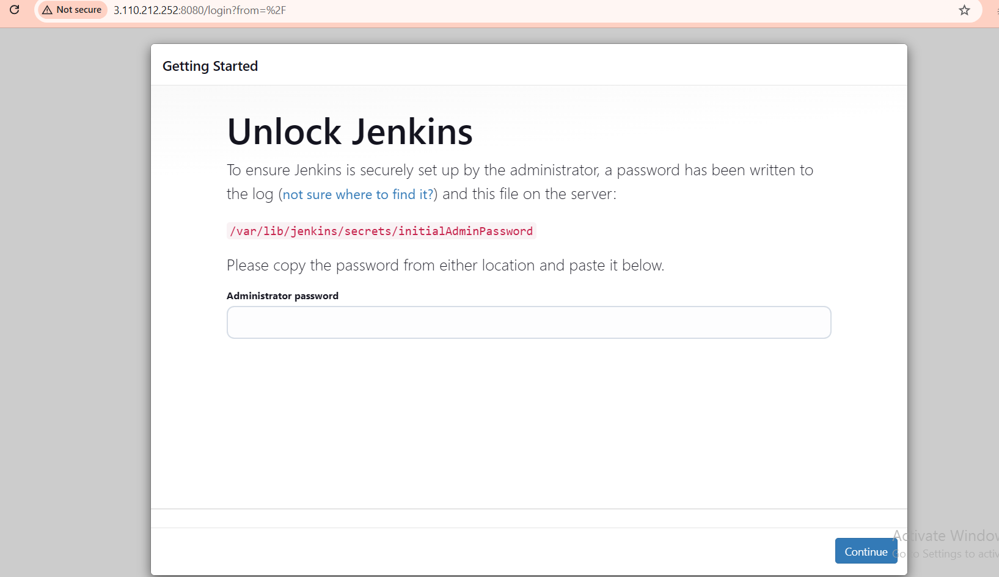
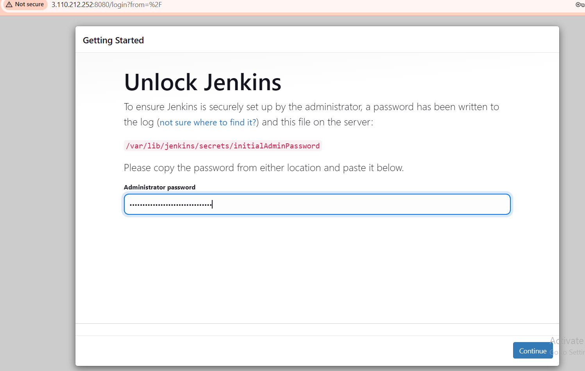
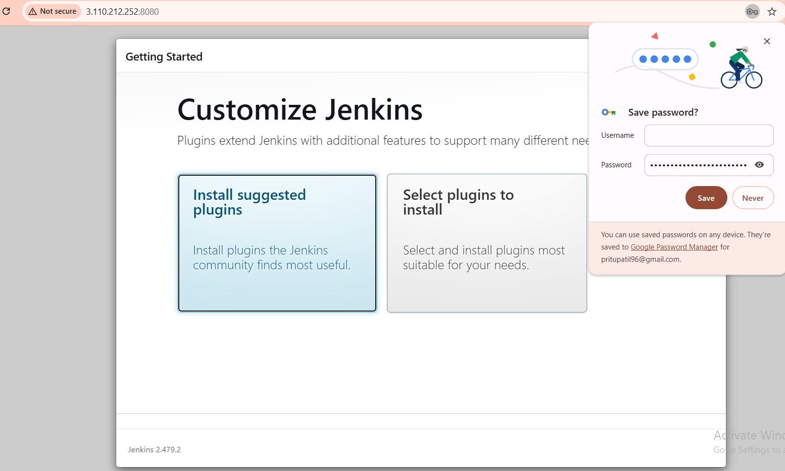
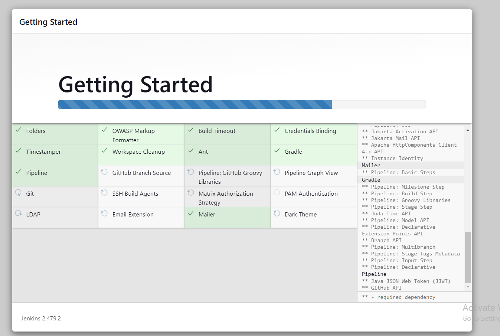
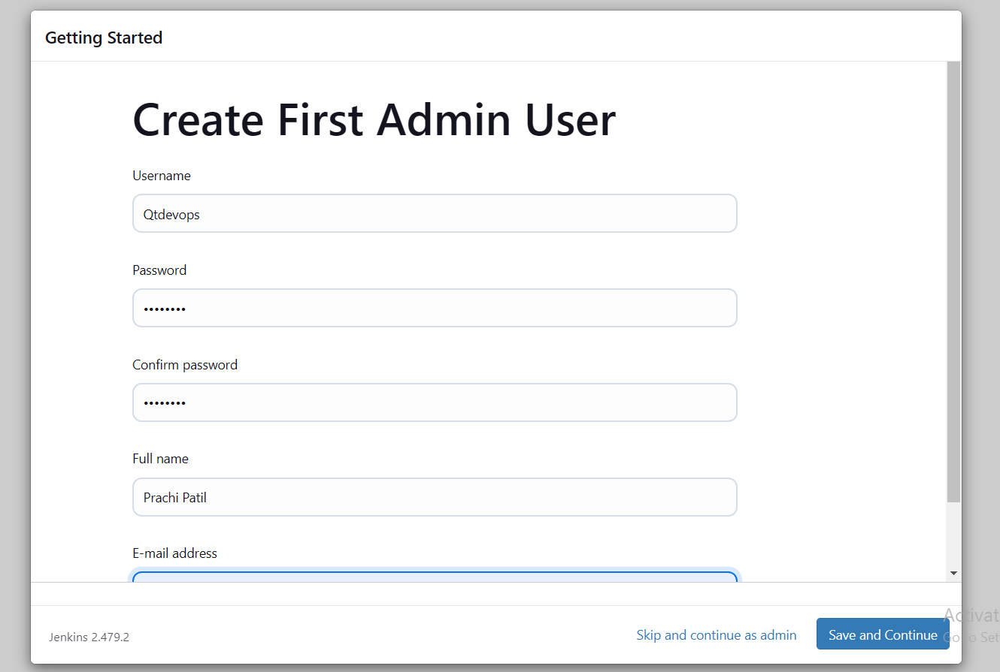
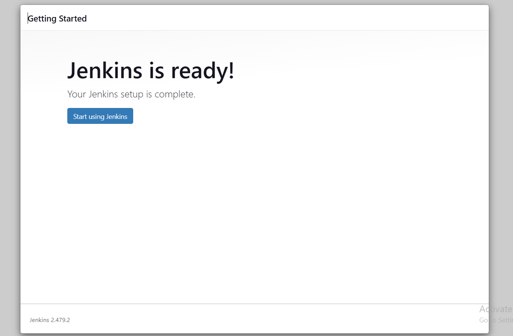
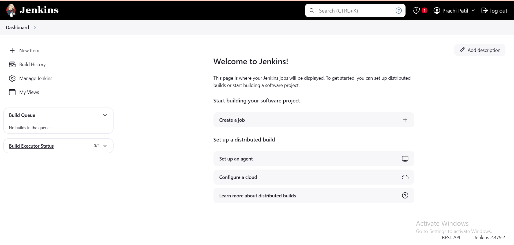

# Jenkins Installation on Ubuntu 22.04

Follow these steps to install Jenkins on Ubuntu 22.04:

## 1. **Update the System**
Ensure your package lists and system are up-to-date:
```bash
sudo apt update -y
sudo apt upgrade -y
```
---

## 2. **Install Java**
Jenkins requires Java to run. Install OpenJDK 17 or higher (Jenkins recommends Java 11):
```bash
sudo apt install -y openjdk-17-jdk
```

### Verify Java Installation:
```bash
java -version
```

---
## 3. **Install Jenkins**
1. download the url from [Jenkins](https://www.jenkins.io/doc/book/installing/linux/#debianubuntu) install jenkins
```bash
    sudo wget sudo wget -O /usr/share/keyrings/jenkins-keyring.asc \
  https://pkg.jenkins.io/debian-stable/jenkins.io-2023.key
    echo "deb [signed-by=/usr/share/keyrings/jenkins-keyring.asc]" \
  https://pkg.jenkins.io/debian-stable binary/ | sudo tee \
  /etc/apt/sources.list.d/jenkins.list > /dev/null
    sudo apt-get update
    sudo apt-get install jenkins
```

---
## 4. **Start and Enable Jenkins Service**
1. Start the Jenkins service:
   ```bash
   sudo systemctl start jenkins
   ```

2. Enable Jenkins to start on boot:
   ```bash
   sudo systemctl enable jenkins
   ```

3. Verify the service is running:
   ```bash
   sudo systemctl status jenkins
   ```
   Ensure the status shows `active (running)`.

    
    
---

## 5. **Access Jenkins**
1. Open a browser and navigate to:
   ```
   http://<your_server_ip>:8080
   ```
   
    

2. You will be prompted to unlock Jenkins. Retrieve the initial admin password:
   ```bash
   sudo cat /var/lib/jenkins/secrets/initialAdminPassword
   ```
   

3. Copy the password, paste it into the browser, and follow the setup wizard to complete the installation.
   
   

---

## 6. **Optional: Install Plugins and Create Admin User**
During the setup wizard, you can:
- Install suggested plugins.
    

    

    

- Create an admin user for managing Jenkins.

    

---

#### Congratulations! Jenkins is now installed and ready to use on Ubuntu 22.04.

 

#### You have Succefully Installed jenkins Youll see the Jenkins Homepage as below

 