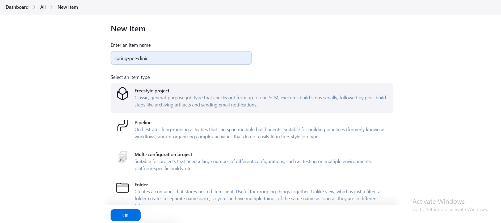
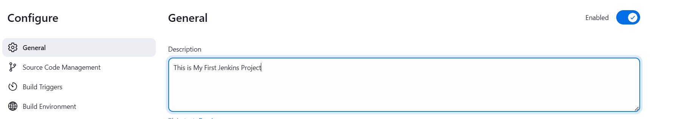
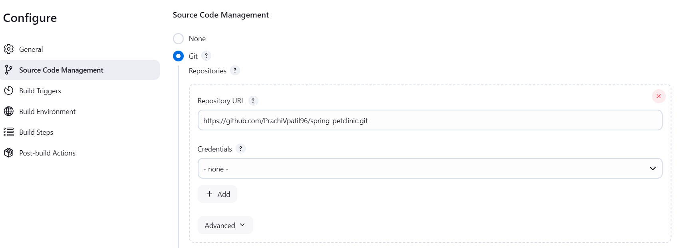
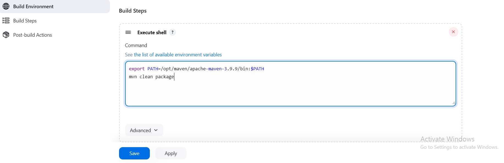
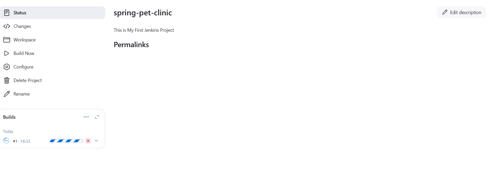

# Creating Your First Freestyle Project in Jenkins

Follow this step-by-step guide to create and configure your first Freestyle project in Jenkins.

---

## **Step 1: Access Jenkins Dashboard**
1. Open your Jenkins URL in a web browser (e.g., `http://<your_server_ip>:8080`).
2. Log in with your credentials.

---

## **Step 2: Create a New Job**
1. Click on the **"New Item"** link in the Jenkins dashboard.
2. Enter a name for your project (e.g., `MyFirstFreestyleProject`).
3. Select the **"Freestyle project"** option.
4. Click **OK**.

    
---

## **Step 3: Configure the Project**
### **General Settings**
- Add a description for your project (optional).
  ```
  This is my first freestyle project in Jenkins.
  ```

  

### **Source Code Management (SCM)**
- If your project uses source control (e.g., Git):
  1. Select **Git** under SCM.
  2. Enter the repository URL.
  3. Provide credentials (if required).

  

Example: I have taken a spring pet clinic application [github](https://github.com/PrachiVpatil96/spring-petclinic.git)
```plaintext
Repository URL: https://github.com/PrachiVpatil96/spring-petclinic.git
Branch: master
```
### **Build Triggers**
- Choose how you want to trigger builds:
  - **Build periodically**: Use a cron schedule (e.g., `H/5 * * * *` to run every 5 minutes).
  - **Poll SCM**: Check for changes in the repository (e.g., `H/5 * * * *`).
  - **Trigger builds remotely**: Use a webhook or an external trigger.

### **Build Environment**
- Check options like "Delete workspace before build starts" or "Use secret text(s) or file(s)", if needed.

### **Build Step**
- Add build steps based on your project requirements. For example:
  - **Execute Shell**: Run a shell script.
    ```bash
    echo "Building the project..."
    ./build.sh
    ```
     

  - **Invoke Ant** or **Invoke Gradle Script** if your project uses those build tools.

  ### **Post-build Actions**
- Add actions to take after the build completes:
  - **Archive the artifacts**: Save files like binaries or reports.
    ```
    Files to archive: target/*.jar
    ```
  - **Email Notifications**: Configure email notifications for build results.
  - **Publish JUnit test result report**: Add test result files.

---

## **Step 4: Save and Build**
1. Click **Save** to store your configuration.
2. Click **Build Now** to trigger your first build.

  

---

## **Step 5: Monitor the Build**
1. Go to the **Build History** section in the left panel.
2. Click on the build number (e.g., `#1`) to view the build details.
3. Check the **Console Output** to see logs and verify the success of the build.

---

## **Optional: View and Manage Artifacts**
- If you archived artifacts in the Post-build Actions, you can view/download them from the build's page under the **Artifacts** section.

---

Congratulations! You've successfully created and run your first Freestyle project in Jenkins! 
